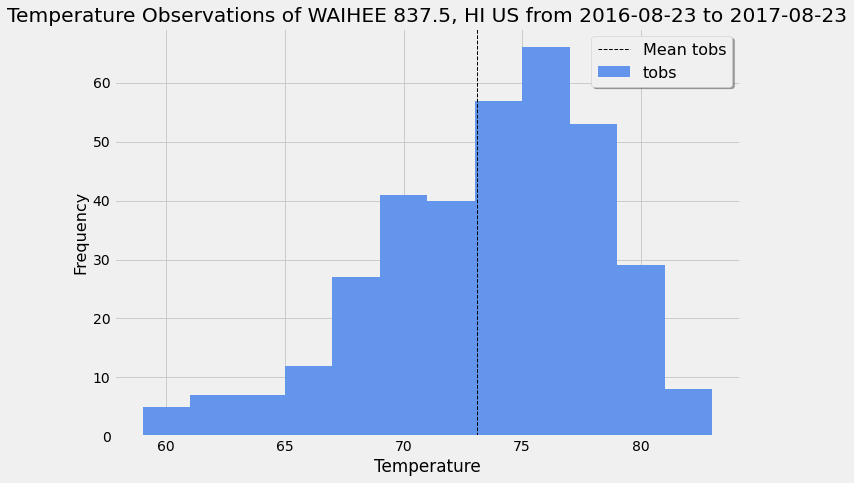

# Surfs Up!

Congratulations! You've decided to treat yourself to a long holiday vacation in Honolulu, Hawaii! To help with your trip planning, you need to do some climate analysis on the area. 

The following analysis is performed using Python and SQLAlchemy to do basic climate analysis and data exploration of your climate database. All of the following analysis should be completed using SQLAlchemy ORM queries, Pandas, and Matplotlib.

## Step 1 - Climate Analysis and Exploration

* Used the provided [starter notebook](climate_starter.ipynb) and [hawaii.sqlite](Resources/hawaii.sqlite) files to complete climate analysis and data exploration.

* Choose a start date and end date for your trip. Make sure that your vacation range is approximately 3-15 days total.

* Used SQLAlchemy `create_engine` to connect to your sqlite database.

* Used SQLAlchemy `automap_base()` to reflect your tables into classes and save a reference to those classes called `Station` and `Measurement`.

### Precipitation Analysis

* A query has been designed to retrieve the last 12 months of precipitation data.

* Selected only the `date` and `prcp` values.

* Loaded the query results into a Pandas DataFrame and set the index to the date column.

* Sorted the DataFrame values by `date`.

* Ploted the results using the DataFrame `plot` method.

  

* Used Pandas to print the summary statistics for the precipitation data.

### Station Analysis

* Designed a query to calculate the total number of stations.

* Designed a query to find the most active stations.

  * List the stations and observation counts in descending order.

  * Which station has the highest number of observations?

* Design a query to retrieve the last 12 months of temperature observation data (TOBS).

  * Filter by the station with the highest number of observations.

  * Plot the results as a histogram with `bins=12`.

    

- - -

## Step 2 - Climate App

A Flask API based application is created on the queries.

* API SQLite Connection & Landing Page

* Generate the engine to the correct sqlite file

* Used autmap_base() and refected the database schema

* Save refrences to the tables in the sqllite file

* Created session to bind the session between the python app and the database

* Use Flask to create your routes.

### API static routes

* `/`

  * Home page.

  * List all routes that are available.

* Precipitation Route
* `/api/v1.0/precipitation`

  * Convert the precipitation data for the last year in the database from query results to a dictionary using `date` as the key and `prcp` as the value.

  * Return the JSON representation of your dictionary with date as the key and the value as the precipitation.

* Station Routes
* `/api/v1.0/stations`

  * Convert the station data of all the station in the database from query results to a dictionary.

  * Return a JSON list of stations from the dataset.

* TOBS Routes
* `/api/v1.0/tobs`
  * Query the dates and temperature observations of the most active station for the last year of data.
  
  * Return a JSON list of temperature observations (TOBS) for the previous year.

* API Dynamic Routes

* Start Route and End Route
* `/api/v1.0/<start>` and `/api/v1.0/<start>/<end>`

  * Return a JSON list of the minimum temperature, the average temperature, and the max temperature for a given start or start-end range.

  * When given the start only, calculate `TMIN`, `TAVG`, and `TMAX` for all dates greater than and equal to the start date.

  * When given the start and the end date, calculate the `TMIN`, `TAVG`, and `TMAX` for dates between the start and end date inclusive.

- - -

## Bonus: Other Recommended Analyses

* The following are optional challenge queries. These are highly recommended to attempt, but not required for the homework.

### Trip Temperature Analysis

* Hawaii is reputed to enjoy mild weather all year. Is there a meaningful difference between the temperature in, for example, June and December?

* You may either use SQLAlchemy or pandas's `read_csv()` to perform this portion.

* Identify the average temperature in June at all stations across all available years in the dataset. Do the same for December temperature.

* Use the t-test to determine whether the difference in the means, if any, is statistically significant. Will you use a paired t-test, or an unpaired t-test? Why?

### Temperature Analysis II

* The starter notebook contains a function called `calc_temps` that will accept a start date and end date in the format `%Y-%m-%d`. The function will return the minimum, average, and maximum temperatures for that range of dates.

* Use the `calc_temps` function to calculate the min, avg, and max temperatures for the trip using the matching dates from the previous year (i.e., use "2017-01-01" if your trip start date was "2018-01-01").

* Ploted the min, avg, and max temperature from previous query as a bar chart.

  * Use the average temperature as the bar height.

  * Use the peak-to-peak (TMAX-TMIN) value as the y error bar (YERR).

    

### Daily Temperature Average

* Calculate the average temperatures per weather station using the previous year's matching dates.

* Calculate the daily normals. Normals are the averages for the min, avg, and max temperatures.

* You are provided with a function called `daily_normals` that will calculate the daily normals for a specific date. This date string will be in the format `%m-%d`. Be sure to use all historic TOBS that match that date string.

* Create a list of dates for your trip in the format `%m-%d`. Use the `daily_normals` function to calculate the normals for each date string and append the results to a list.

* Load the list of daily normals into a Pandas DataFrame and set the index equal to the date.

* Use Pandas to plot an area plot (`stacked=False`) for the daily normals.

  

### Copyright

Trilogy Education Services © 2020. All Rights Reserved.
